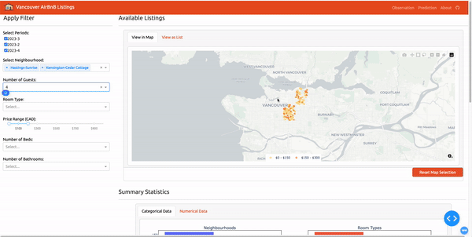
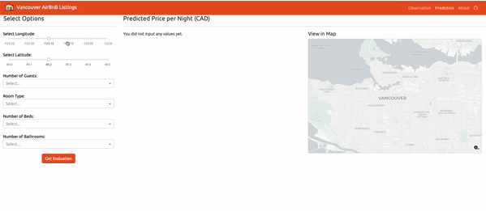
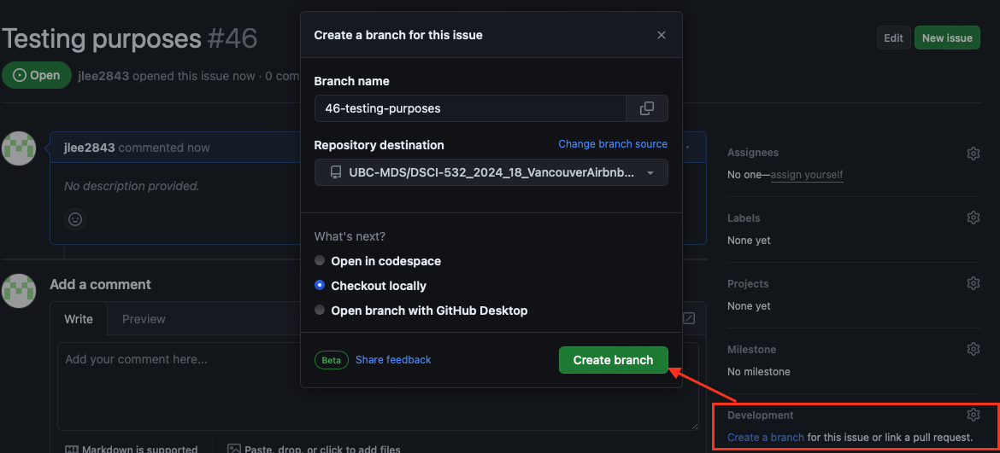
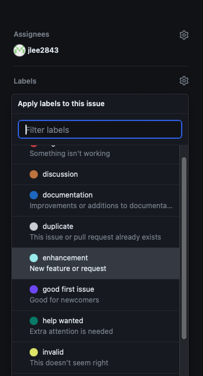

# Vancouver Airbnb Pricing Dashboard
> A dashboard for investigating Vancouver housing price trends through Airbnb housing data.

**Group members**: Jenny Lee (@jlee2843), Wenyu Nie (@wenyunie),Ella Hein (@ella-irene), Kiersten Gilberg (@Kierst01)




## Motivation
This dashboard, created by a team of Master of Data Science students, offers a comprehensive and interactive platform designed to assist Airbnb hosts in Vancouver with pricing their listings. Drawing from a rich dataset of eight years of Airbnb listings in the city, our app provides a deep dive into various aspects of the rental market, from geographical trends to detailed property features.

Key features of the dashboard include: An interactive map highlighting the price range in different Vancouver neighborhoods, detailed filters allowing users to customize their search based on property type, number of bedrooms, and more, visualization of historical data on rental prices, offering insights into market trends, and a predictive model to help hosts estimate appropriate pricing for their listings.

Whether you are an existing Airbnb host or planning to list your property, our dashboard is tailored to provide valuable insights and predictions to help you navigate the dynamic rental landscape in Vancouver.

## How to Get Support
### Contributing To Our Project
We welcome contributions to our project, whether it's proposing new features or modifying existing ones. To get involved, please refer to our [How To Contribute](https://github.com/UBC-MDS/DSCI-532_2024_18_VancouverAirbnbPrices/blob/main/CONTRIBUTING.md) documentation.

This project is open-source, meaning anyone interested in its further development is encouraged to participate.

### Submitting an Issue
If you have a proposal for a change or addition to the project, please open a GitHub Issue [Github Issue](https://github.com/UBC-MDS/DSCI-532_2024_18_VancouverAirbnbPrices/issues) detailing your proposed implementation. Then, create a branch from the issue to begin making changes to the code.



When opening the issue, ensure to go through the appropriate labeling step to categorize and prioritize it effectively.



## Running the Dashboard Locally
### Installing Dependencies
To install all Python dependencies necessary for running the app locally, you can utilize the `environment.yml` file. This file contains a list of dependencies required for the project. You can install them using a package manager such as Conda. List of dependencies needed for this dashboard are:

```
  - python=3.8.19
  - dash=2.16.1
  - dash-core-components=2.0.0
  - dash-html-components=2.0.0
  - dash-renderer=1.9.1
  - dash-table=5.0.0
  - plotly=5.19.0
  - pandas=2.0.3
  - numpy=1.24.4
  - scipy=1.10.1
  - gunicorn=21.2.0 # For deployment
  - joblib=1.3.2
  - pip=24.0
  - pip:
    - flask-caching==2.1.0
    - scikit-learn==1.3.2
    - dash-bootstrap-components==1.5.0
    - pyarrow==15.0.2
```

##### Steps to Follow for Installing Dependencies:
1. Open a terminal or command line on your local computer.
2. Navigate to the directory or folder containing the `index.py` file.
3. Run the following command below to install the dependencies.
```
conda env create -f environment.yml
```
4. Activate the environment using `conda` as below.
```
conda activate dash_env
```

### Running the App Locally
To run the app locally, please run the command below on your local terminal or command line after navigating to the root folder containing `index.py`. 
```
python index.py
```