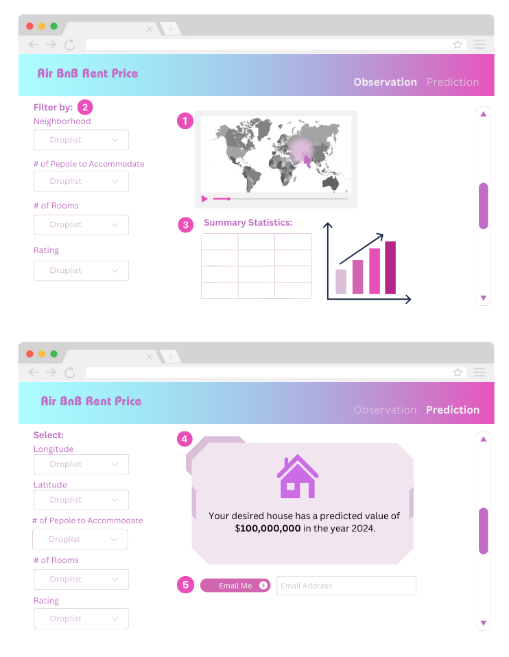

# Milestone 1 - Dashboard Proposal

## Section 1: Motivation and Purpose
Vancouver's housing market has been a major topic of discussion, as the price of housing and accomodations as skyrocketed over the past few years. The rise of houses prices has become a limitation to many hoping or move to or visit Vancouver, one of Canada's largest and most scenic cities. 

This dashboard offers an interactive platform for people who are looking to move to or visit Vancouver. An interactive map of the city shows the Airbnb listing prices of homes across the city, giving the user an idea of which neighborhoods fall could within their price-range, either to stay in or to rent. Visualizations of historical data from the past five years shine light onto the housing price trends broken down by size, neighborhood, and other important factors in considering a home. By visualizing breakdowns of the housing market in Vancouver, we hope to make renting ,buying, or staying in Vancouver a much less daunting task.

## Section 2: Description of the data
The project will analyze an expansive dataset covering eight years of Airbnb listings in Vancouver. The dataset currently comprises approximately 215,000 rows, derived from an estimated 6,690 rows (see the latest quarterly sample, data/raw/listings.csv) for each of the four quarters spanning eight years; this number is still pending final approval. Of the 75 columns available in the dataset, a preliminary selection of 25 columns has been made for initial analysis, with the final choice of columns to be determined as the project progresses. This collection of data will feed into a user-centric dashboard designed to illuminate the shifting dynamics of the local short-term rental market.

The dashboard will provide interactive features for users to filter and analyze Airbnb listings based on diverse criteria:

1. Geographical Insights: With an interactive map at the forefront, users can pinpoint specific neighborhoods to observe pricing trends, leveraging variables such as `latitude`, `longitude`, and `neighbourhood_cleansed`.

2. Detailed Listings and Host Profiles: The dashboard will showcase individual listing details, including `id`, `name`, `description`, and `picture_url`, as well as comprehensive host information, from `host_since` and `host_is_superhost` status to `host_response_rate` and `host_identity_verified`. This offers a granular view of the listings and their hosts' track record.

3. Property Features and Amenities: Users can sift through properties based on features like `property_type`, `room_type`, `bedrooms`, `beds`, and `amenities`, providing a tailored search experience that matches specific accommodation needs.

4. Pricing Analysis and Predictions: Critical for both guests and hosts, the dashboard will render current pricing information and provide predictive insights for future price trends. Factors like `price`, `minimum_nights`, and `maximum_nights` will be instrumental in this area.

5. Review Score Analytics: The dashboard will highlight guest feedback through `review_scores_rating` and related metrics, influencing decision-making for potential renters and indicating areas of improvement for hosts.

6. Usage and Popularity Metrics: Key statistics such as `number_of_reviews` and `reviews_per_month` will gauge listing popularity and guest satisfaction, vital for market analysis.

In addition to these features, we will derive new variables to deepen our understanding of the market. For instance, `price_per_guest` will offer insights into value propositions across listings, while `host_duration` will assess the impact of hosting experience on listing success.

The dashboard will serve as a portal not just for observation but also for the prediction of rent prices, leveraging historical data to forecast future trends, with the 'Email Me' feature providing users with a direct line to receive personalized updates.

## Section 3: Research questions and usage scenarios

Sofia is an airbnb host who wants to obtain the optimal price for her Vancouver airbnb property. She would like to [explore] the prices and features of other properties, [compare] her property to similar listings, and [predict] the price of a new listing.

Sofia can assess this by using our "Vancouver Airbnb Listings" dashboard. She can begin by using the map function to view the Vancouver neighbourhoods and the number of listings in each. Then she can use the dropdown filters to focus her comparison on specific types of properties, she can filter for the values: number of bedrooms, number of bathrooms, number of people to accomodate, neighbourhood, and type of property. She can also use the slider to select a range of prices. This will display the most current summary statistics for properties meeting the selected criteria. From this she can compare her listing to other similar airbnb properties. She can also use the line chart of listing values across time (available dates are quarterly for 2023) to visualize the most recent trends in listing prices. This will help her price her listing effectively, as she can adjust to the changing market.

Additionally, if Sofia goes to the second page of our dashboard, she can use our predictive model to estimate the price range for a new listing. To do this she would select the values that match her new property from the dropdown menu and click the 'predict' button. This would then return the predicted price range of properties matching these criteria. This would help Sofia find an appropriate price for her new new airbnb listing, making it attractive to people looking to book airbnbs in Vancouver.

## Section 4: App Sketch & Breif Descriptions

#### Landing Page
This app comprises two pages (tabs), with one serving as the main page, named **Observation**. Here, users can access current listings and apply filters based on listing locations, features, and customize their searches as desired.

#### Prediction Page
The second page, named **Prediction**, will feature the implementation of a simple machine learning model to predict the expected rating price based on the provided feature values by the users.

##### ▸ Page Components:
Components are described according to their numbering in the image above.
1. **Map**: This interactive map showcases a segment of Vancouver, highlighting Airbnb listings as dots. Listings are color-coded based on their location, utilizing the `neighborhood` column from the data. Additionally, a slider feature allows users to view listings over a specified time period, ranging from a few years back to the most recent date available in our dataset.
2. **Filter By**: This side menu offers users the flexibility to select specific filters for their search criteria. If no filters are selected, the search results remain unfiltered, displaying the entire dataset on the map alongside summary statistics and visualizations on the right-hand side. Initial filter options include `neighborhood`, `accommodates`, `bedrooms`, and `review_scores_rating`, with the possibility of adding more filter options in the future.
3. **Summary Statistics**: Based on the user-selected filters, summary statistics of the filtered listings are presented. For instance, average price per night for the filtered listings, along with 25th and 75th percentiles, are provided. Additionally, visualizations depicting price trends in the area over the past five years (approximately) are included for enhanced insights.
4. **Predicted Price**: This section displays the predicted price of an unseen listing generated from the selected user options. In case a value is not selected for one of the options, appropriate imputation methods will be applied to handle missing values (further details to be discussed).
5. **Send Email**: If desired, users have the option to receive an email containing the selected options and the predicted price for the new listing per night.